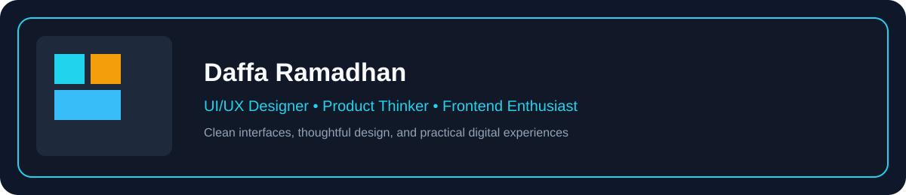

# 

  🎨 UI/UX Designer | 💡 Product Thinker | ⚡ Frontend Enthusiast

## UI/UX & Design Stack

  
  
  
  
  
  
  
  
  

### Design Focus

  ✨ User Interface Design | 🧠 UX Thinking | 🎯 Product Experience | 🖼️ Visual Design | ♿ Accessibility

## Currently Building

Designing intuitive digital experiences, polished interfaces, and practical product ideas with a strong focus on usability and aesthetics.

## Design Principles

  🎨 Clarity | 🧭 Consistency | ⚡ Speed | ♿ Accessibility | 🧠 Empathy

## GitHub Statistics

> If the cards below show broken images, check your username and wait a minute for the services to generate them. These endpoints are widely used and usually reliable.

  

  

  

  For a fun contribution-graph (Puzzle/Arcade), follow instructions at: https://github.com/rhellokitty/rhellokitty

