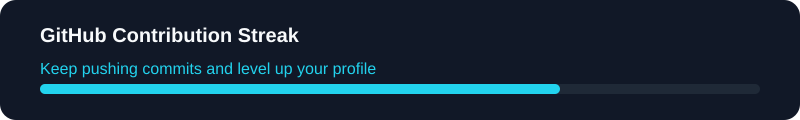

# 

  🎨 UI/UX Designer | 💡 Product Thinker | ⚡ Frontend Enthusiast

  <a href="https://rzadaffa.netlify.app">Portfolio</a>
  ·
  <a href="https://www.linkedin.com/">LinkedIn</a>
  ·
  <a href="https://www.tiktok.com/@rzadaffa_">TikTok</a>
  ·
  <a href="mailto:muhammadrajadaffa@gmail.com">Email</a>

## UI/UX & Design Stack

  
  
  
  
  
  
  
  
  
  
  
  

### Design Focus

  ✨ User Interface Design | 🧠 UX Thinking | 🎯 Product Experience | 🖼️ Visual Design | ♿ Accessibility

## Currently Building

Designing intuitive digital experiences, polished interfaces, and practical product ideas with a strong focus on usability and aesthetics.

## Design Principles

  🎨 Clarity | 🧭 Consistency | ⚡ Speed | ♿ Accessibility | 🧠 Empathy

## GitHub Statistics

  

  

  

  

